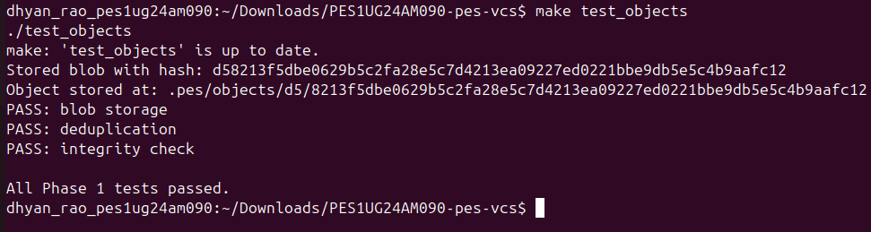
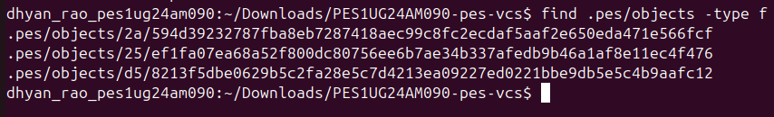
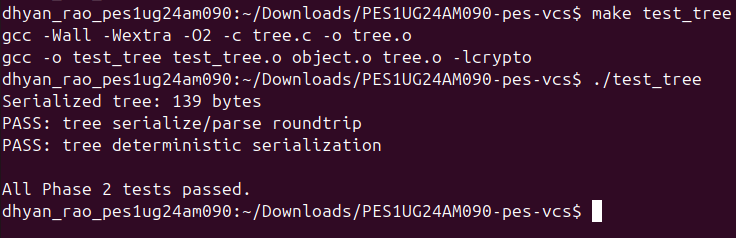
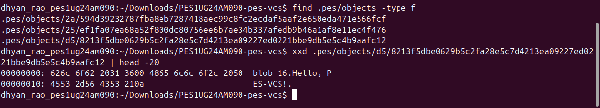
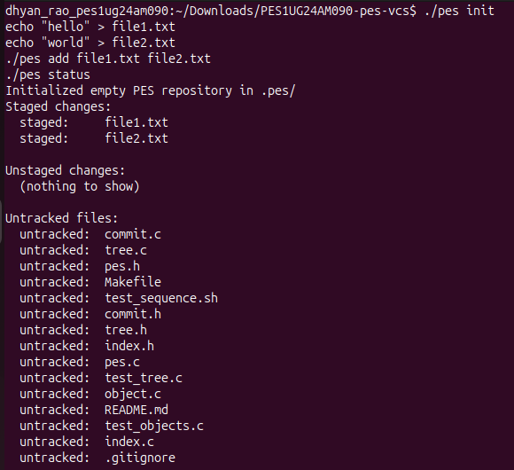
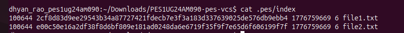
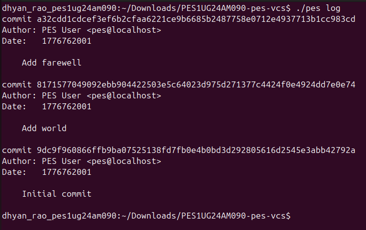
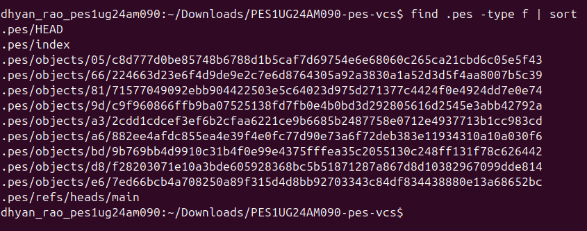
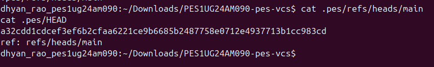
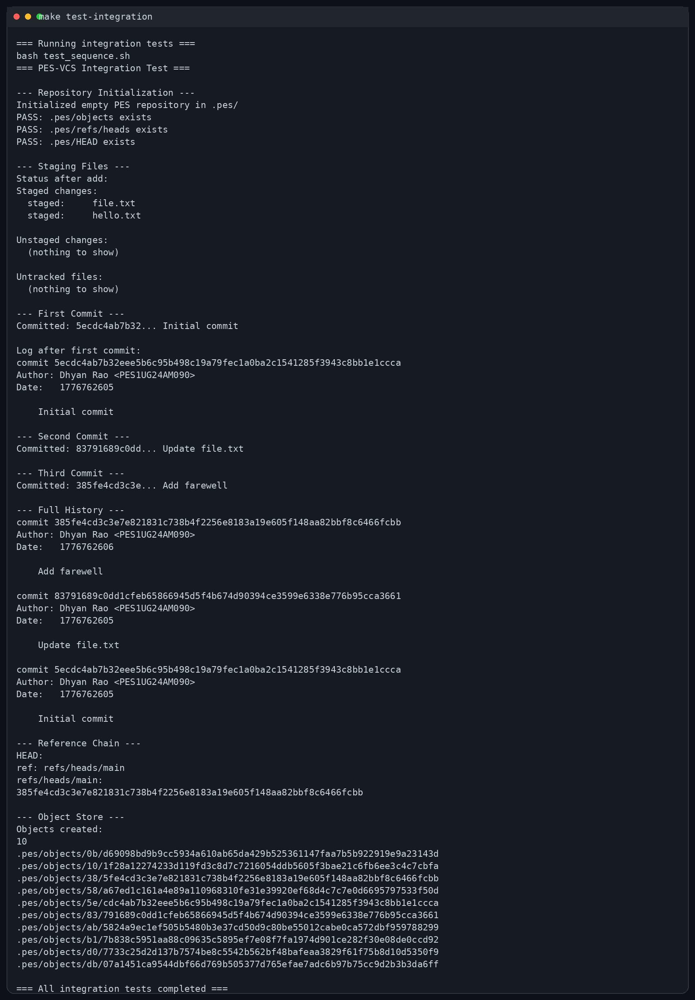

# PES-VCS Assignment Report

Name: Dhyan Rao  
SRN: PES1UG24AM090

## Screenshots

### Screenshot 1A

### Screenshot 1B

### Screenshot 2A

### Screenshot 2B

### Screenshot 3A

### Screenshot 3B

### Screenshot 4A

### Screenshot 4B

### Screenshot 4C

### Final Integration Test

## Phase 5 and 6 Answers

### Q5.1

A branch in PES-VCS would be implemented as a file inside `.pes/refs/heads/` that stores a commit hash, exactly like Git does. To implement `pes checkout <branch>`, the first step is to read `.pes/refs/heads/<branch>` to get the target commit hash. Then `.pes/HEAD` should be updated to contain `ref: refs/heads/<branch>` so that future commits advance that branch. After resolving the target commit, PES-VCS must read the commit object, load its root tree, recursively walk every tree and blob beneath it, and rewrite the working directory so the files on disk match the checked-out snapshot. Files tracked in the current branch but absent in the target branch must be removed, and files that differ must be replaced with the correct blob contents and file modes.

The complexity comes from the fact that checkout is not only a metadata change inside `.pes/`. It also mutates the working directory, which means it must carefully preserve correctness and avoid clobbering user changes. Nested directories must be created and removed safely, executable bits must be restored correctly, and the index would also need to be refreshed so it matches the checked-out commit.

### Q5.2

To detect a dirty working directory conflict, I would compare three states: the working directory, the index, and the target branch tree. The index tells me what content and metadata were last staged for each tracked path. The target tree tells me what content would appear after checkout. The working directory tells me whether the user has changed a tracked file since it was staged.

For every tracked file path, I would first compare the working directory file's metadata against the index entry. If the size or modification time differs, I would then hash the file's current contents and compare that hash against the blob hash stored in the index. If the file differs from the index and the target branch would also write a different version of that same path, checkout must refuse because switching branches would overwrite uncommitted local work. If the file matches the index, then it is safe to replace it with the target branch's version.

### Q5.3

Detached HEAD means `.pes/HEAD` stores a commit hash directly instead of storing a symbolic reference like `ref: refs/heads/main`. If you make commits in this state, the commits are still created normally and each new commit points to the previous commit as its parent, but no branch name moves forward to reference them. Because of that, the commits can later become hard to reach once HEAD is moved somewhere else.

A user can recover detached-HEAD commits by creating a new branch that points to the current detached commit hash. Once a branch reference is created, those commits become reachable again through that branch and will no longer be considered orphaned history.

### Q6.1

Garbage collection should start from every branch head in `.pes/refs/heads/` and mark all reachable objects. For each reachable commit, the algorithm should mark the commit object itself, then recursively mark its parent commit, the tree it references, every subtree inside that tree, and every blob referenced by those trees. After this mark phase is complete, PES-VCS can scan `.pes/objects/` and delete any object whose hash was never marked as reachable.

The best data structure for tracking reachability is a hash set of object hashes because insertion and membership checks are efficient. For a repository with 100,000 commits and 50 branches, the walk would usually visit approximately the number of unique reachable commits rather than 100,000 multiplied by 50, because most branches share a large amount of history. In addition to those commits, the traversal must also visit the reachable trees and blobs referenced by those commits.

### Q6.2

Running garbage collection concurrently with a commit operation is dangerous because commit creation writes new objects before the branch reference is updated. A race condition can happen if the commit process has already written a new tree object and a new commit object into `.pes/objects/`, but has not yet updated `.pes/refs/heads/main`. If garbage collection scans the refs during that small window, it will not see any branch pointing to the new commit, so it may incorrectly treat those new objects as unreachable and delete them. Then, when the commit operation finally updates the branch ref, the branch could point to missing objects.

Git avoids this problem by using locking, atomic updates to refs, temporary files followed by rename, and conservative garbage collection rules that avoid immediately pruning every object that appears unreachable. In practice, Git's GC is designed so objects that were very recently created are not aggressively deleted during these race windows.

## Submission Notes

- The screenshots provided in `OS_Orange_U4_SS.docx` were extracted into the `screenshots/` folder so they can be embedded directly in this report.
- The final integration screenshot was generated from a fresh successful `make test-integration` run.
- This report is stored at the repository root in Markdown format, which matches the README submission requirement.
